<div align="center">

# Retail Decision Support System

**An end-to-end retail analytics pipeline that transforms transaction data into SQL-driven insights, AI-assisted executive reporting, and interactive Power BI dashboards.**


</div>

---

## Architecture

The architecture integrates MySQL, Python automation, and the Google Gemini API to transform retail transaction data into executive-ready business insights.
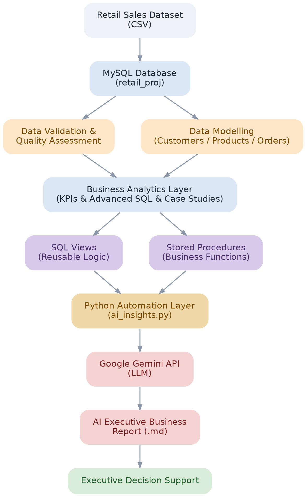

## Overview

Retail businesses generate large volumes of transactional data but often lack a structured pipeline to convert that data into decision-ready insight. This project builds that pipeline end-to-end — from raw CSV ingestion, through data validation and relational modelling, into advanced SQL analytics, and finally into an AI-assisted executive report suitable for leadership review.

## Project Highlights

- 34,500 Retail Transactions
- 7,903 Customers
- 3NF Relational Data Model
- 8 SQL Modules
- Advanced SQL (CTEs, Window Functions, Joins)
- Views & Stored Procedures
- Python Automation
- AI-Assisted Executive Reporting

## Key Findings

- **Electronics drives ~57% of total revenue** despite similar unit sales to other categories — growth here is price-point driven, not volume driven.
- **East region underperforms across all metrics**: slowest delivery (5.99 days) and highest return rate (5.91%), while Central generated the lowest revenue despite strongest operational performance (4.01 days, 5.10% returns).
- **Top 3 customers by lifetime value derive 93–99% of their lifetime value from a single transaction**, highlighting an opportunity to improve repeat purchasing among high-value customers.
- **Discounts above 30% drive only 1.6% of revenue** while eroding average order value by ~24%, suggesting a shift toward threshold-based offers over blanket discounting.

Full analysis: [`sql/7.business_case_studies.sql`](sql/7.business_case_studies.sql) · Full report: [`reports/executive_report_final.md`](reports/executive_report_final.md)

## Tech Stack

| Layer | Tools |
|---|---|
| Database | MySQL 8 (Workbench) |
| Automation | Python 3, Pandas, mysql-connector-python |
| AI Layer | Google Gemini API (LLM) |
| Development | Visual Studio Code |
| Version Control | Git + GitHub |

## Workflow

The workflow follows a structured analytics lifecycle-from data validation and relational modelling to SQL analytics, reusable database objects, Python automation, AI-assisted reporting, and manual business review. Two review loops ensure both data quality and factual accuracy before the final report is published.
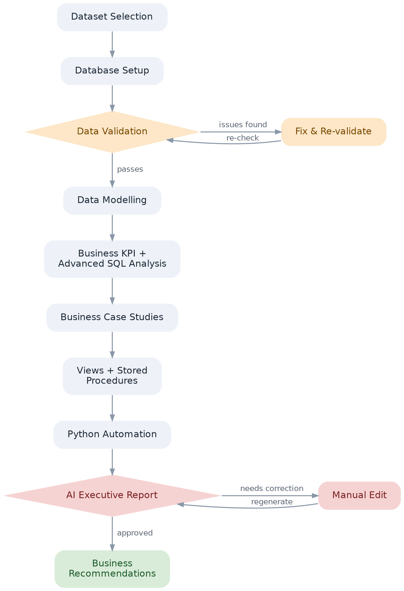

## Entity Relationship Diagram

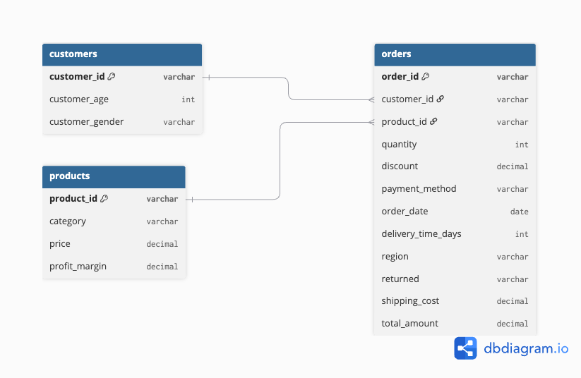

The database is normalized into three core entities—Customers, Orders, and Products—to reduce redundancy and support scalable analytical queries through primary and foreign key relationships.

## Power BI Dashboard

An interactive Power BI dashboard extends the SQL analysis into an executive-facing business intelligence layer, covering overall performance, products, regions, and categories.

### Dashboard Pages

| Page | Purpose |
|---|---|
| Executive Overview | Summarizes overall sales performance and key business KPIs |
| Product Performance | Identifies high-selling and high-revenue products using revenue, units sold, and profit margin |
| Regional Performance | Compares regional revenue, delivery performance, and return rates |
| Category Performance | Compares category revenue, units sold, discounts, and profit margins |

### Dashboard Screenshots

#### Executive Overview
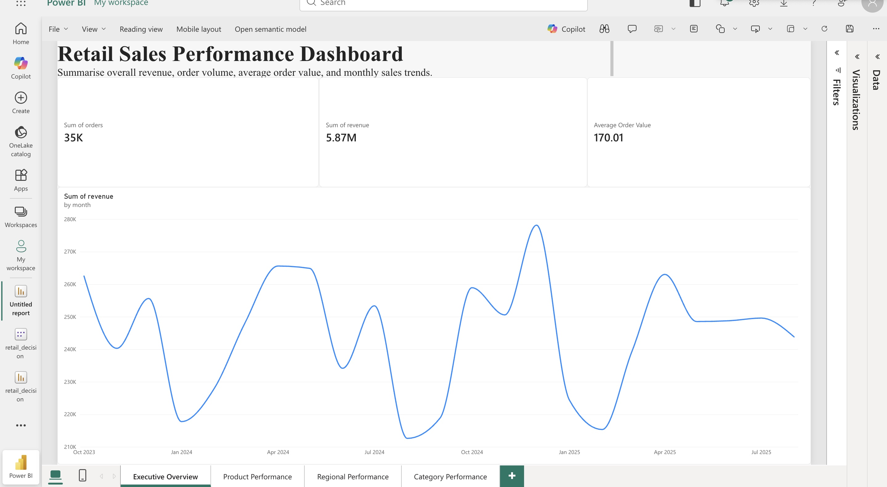

#### Product Performance
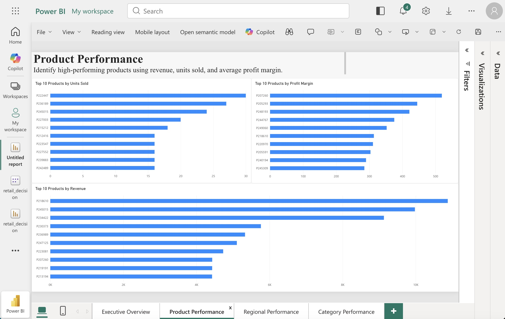

#### Regional Performance
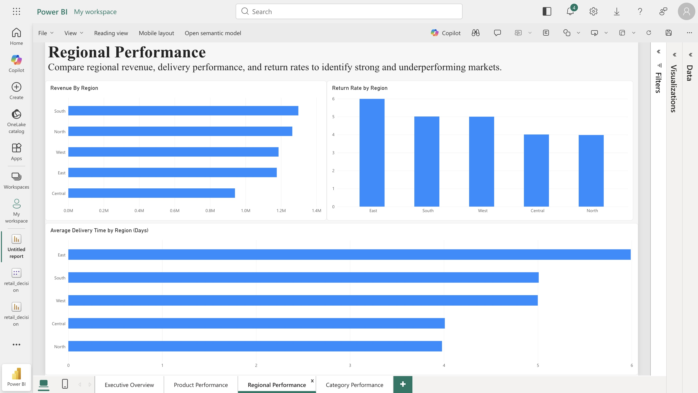

#### Category Performance
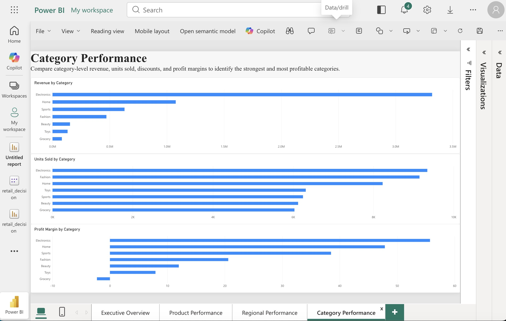

## Folder Structure

```
├── dataset/            # Source data + provenance notes
├── sql/                # Numbered SQL pipeline (setup → validation → modeling → analysis → views → procedures)
├── python/             # AI automation and executive reporting
├── reports/            # Generated + human-reviewed executive report
├── docs/               # Architecture, ER, and workflow diagrams
├── powerbi/            # Power BI dashboard + dashboard screenshots
├── screenshots/        # Execution proof (queries, procedures, terminal output)
└── requirements.txt
```

**SQL Pipeline:**

| File | Purpose |
|---|---|
| `1.database_setup.sql` | Raw table creation |
| `2.data_profiling.sql` | Initial data profiling and exploration |
| `3.data_validation.sql` | Null, duplicate, and range checks |
| `4.data_modeling.sql` | Normalized schema with PK/FK constraints |
| `5.business_analysis.sql` | Core KPIs and segment breakdowns |
| `6.advanced.sql` | Window functions, CTEs, ranking, Pareto analysis |
| `7.business_case_studies.sql` | Consulting-style business case studies with SQL-driven recommendations |
| `8.views.sql` | Reusable reporting views |
| `9.stored_procedures.sql` | CLV, regional scorecard, ABC classification, risk screening |

## How to Run

```bash
git clone https://github.com/unnatirai21/retail-decision-support-system.git
cd retail-decision-support-system
pip3 install -r requirements.txt
cp .env.example .env   # then fill in your own MySQL + Gemini credentials
```

1. Run `sql/1.database_setup.sql` through `sql/9.stored_procedures.sql` in MySQL Workbench, in order.
2. Run the AI insight generator:
```bash
python3 python/ai_insights.py
```
3. Output saves to `reports/executive_report_generated.md`.
4. Human-reviewed version: `reports/executive_report_final.md`.

*The project uses the Google Gemini API for automated executive reporting. The generated report is manually reviewed and corrected for accuracy before being published as `executive_report_final.md`.*

## Screenshots

| Database Design | Views |
|---|---|
| 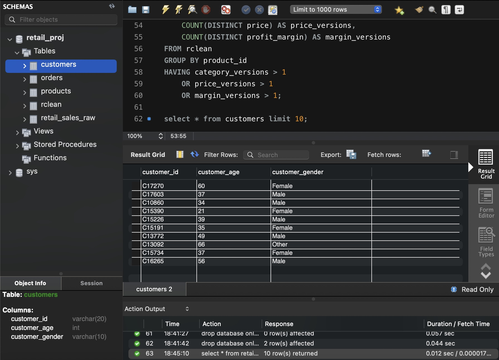 | 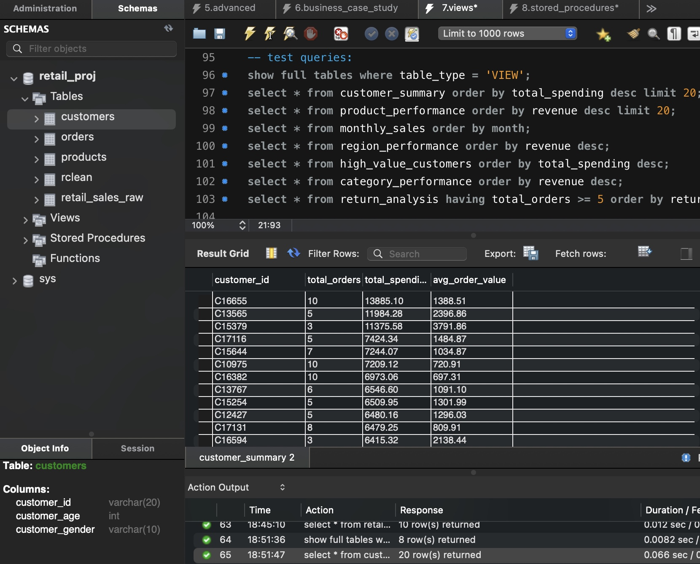 |

| Stored Procedure Execution | Executive Report |
|---|---|
| 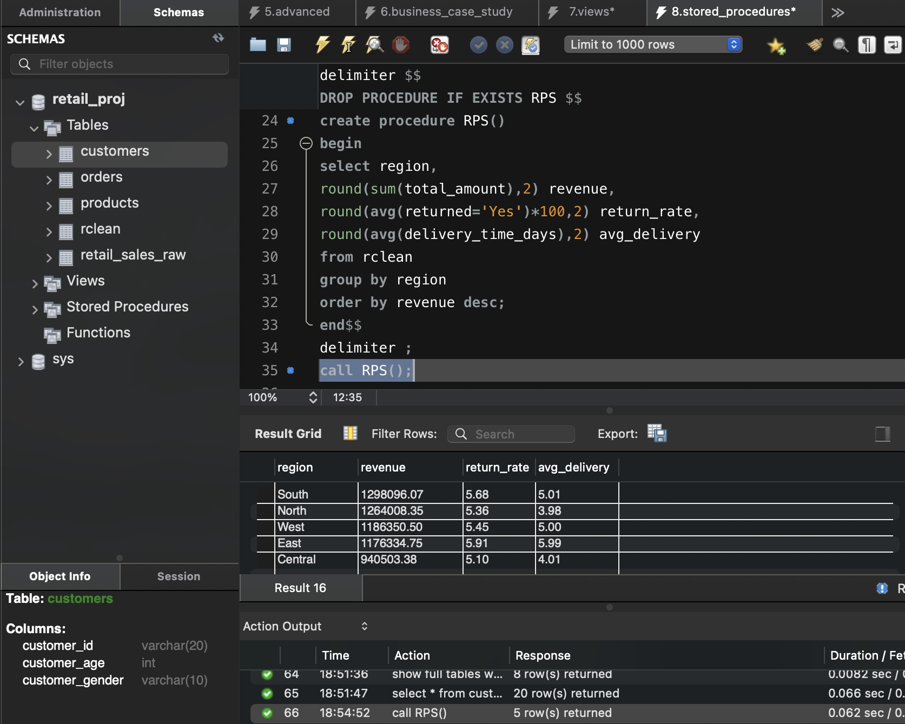 | 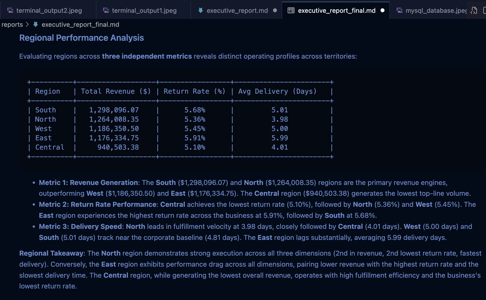 |

| Terminal Execution |
|---|
| 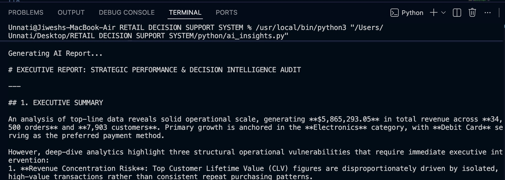 |

## Data Source

This project uses a synthetic retail transaction dataset sourced from Kaggle for educational and portfolio purposes. Additional dataset details are available in [`dataset/dataset_source.md`](dataset/dataset_source.md).

## Author

**Unnati Rai**
B.Sc. Economics (Hons.) — Data Analytics
[LinkedIn](https://www.linkedin.com/in/unnatirai) · [GitHub](https://github.com/unnatirai21)

## License

MIT — see [LICENSE](LICENSE).
